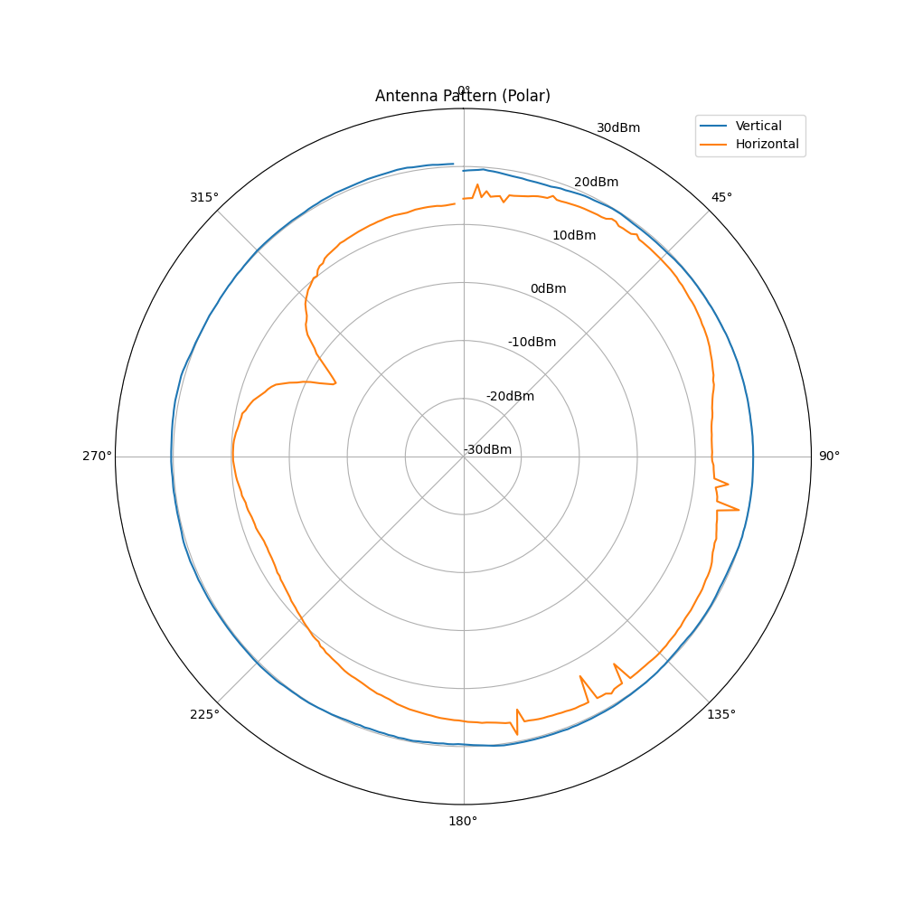
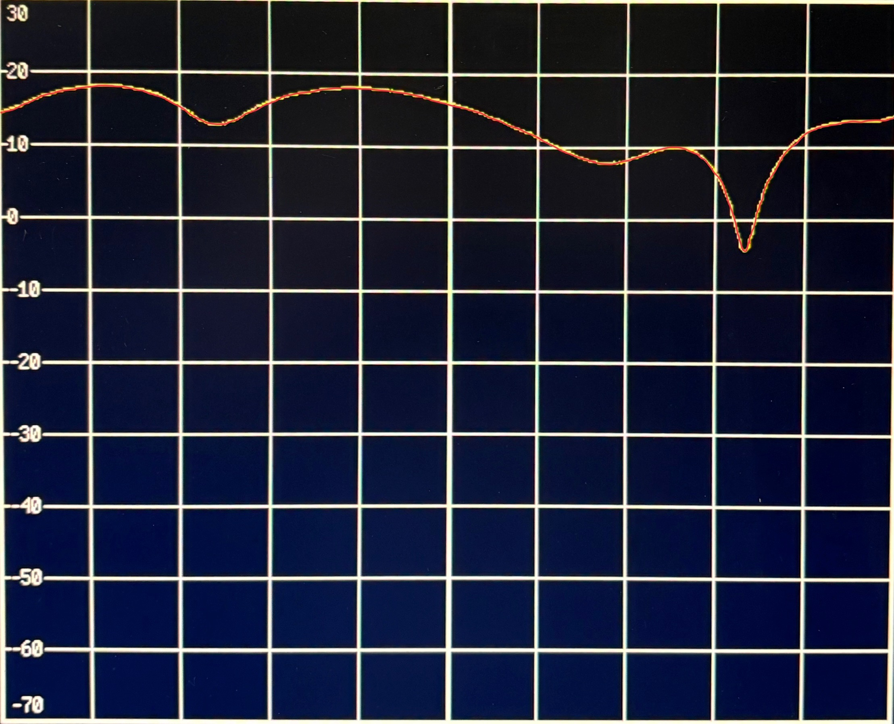
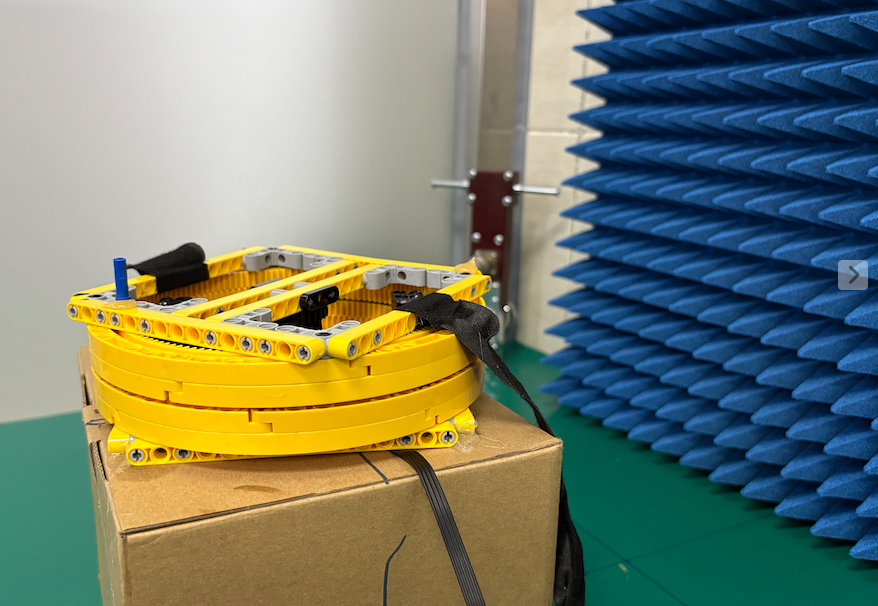
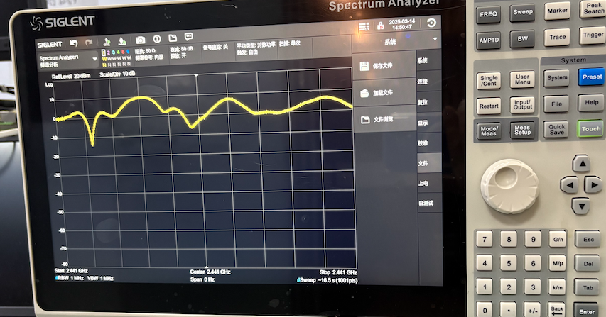

# Antenna Pattern Analysis using OpenCV

<div align="center">
  
</div>

## 📋 Overview

This project provides tools for analyzing and visualizing antenna radiation patterns using computer vision techniques. It includes both Python (OpenCV) and MATLAB implementations for processing antenna measurement data and generating polar plots.

The system can extract radiation pattern data from antenna measurements and visualize them in standard formats used in RF engineering.

<div align="center">
  
</div>

## ✨ Features

- 📊 Image processing of antenna measurement data using OpenCV
- 🔄 Generation of polar radiation pattern plots
- 📡 Support for both vertical and horizontal polarization measurements
- 💾 Data export to CSV format
- 📈 Visualization using both Python (Matplotlib) and MATLAB
- 🔍 Frequency response analysis in 2.4GHz band

## 🛠️ Test Setup

The antenna measurements were performed in an anechoic chamber using a cylindrical monopole antenna. The test setup includes:

<div align="center">
  
</div>

- Spectrum analyzer for signal measurement
- Rotating platform for 360° pattern measurement
- Cylindrical monopole antenna under test
- RF signal generator for excitation

### Measurement Environment

The antenna pattern measurements were conducted in a controlled environment to ensure accurate results:

<div align="center">
  
</div>

- Anechoic chamber with RF absorbing material
- Calibrated measurement equipment
- Controlled temperature and humidity
- Shielded from external RF interference

## 📐 Theoretical Background

The antenna radiation pattern analysis is based on fundamental electromagnetic principles. The relationship between the measured signal strength and the antenna gain is given by:

<div align="center">
  
</div>

Where:
- G(θ,φ) represents the antenna gain as a function of direction
- P_r is the received power
- P_t is the transmitted power
- R is the distance between antennas
- λ is the wavelength

## 📦 Requirements

### Python Dependencies
- OpenCV (cv2) >= 4.5.0
- NumPy >= 1.19.0
- Matplotlib >= 3.3.0
- Pandas >= 1.2.0

### MATLAB Dependencies
- MATLAB R2019b or later
- Signal Processing Toolbox

## 🚀 Installation

1. Clone the repository:
```bash
git clone https://github.com/ben0724-ACE/antenna-pattern-use-openCV.git
cd antenna-pattern-use-openCV
```

2. Install Python dependencies:
```bash
pip install -r requirements.txt
```

## 📝 Usage

### Python Implementation
```bash
python src/antennaPattern.py
```

### MATLAB Implementation
1. Open MATLAB
2. Navigate to the project directory
3. Run:
```matlab
plotAntennaPattern
```

## 📂 Project Structure
```
antenna-pattern-use-openCV/
├── src/
│   ├── antennaPattern.py      # Python implementation using OpenCV
│   └── plotAntennaPattern.m   # MATLAB implementation
├── data/
│   ├── cylindrical_monopole_V.jpg  # Vertical polarization measurement
│   ├── cylindrical_monopole_H.jpg  # Horizontal polarization measurement
│   └── antenna_data.csv            # Processed measurement data
├── results/
│   ├── antenna_pattern_matlab.png  # MATLAB generated visualization
│   └── antenna_pattern2.png        # Python generated visualization
├── images/                    # Images for documentation
│   ├── radiation_pattern.png  # Radiation pattern visualization
│   ├── spectrum_analyzer.png  # Spectrum analyzer display
│   ├── test_setup.jpg         # Test setup in anechoic chamber
│   ├── setup.png              # Measurement environment
│   └── equ.png                # Theoretical equations
├── requirements.txt           # Python dependencies
└── README.md                  # Project documentation
```

## 📊 Results

The program generates two types of visualization:
1. Python-generated polar plot (antenna_pattern2.png)
2. MATLAB-generated polar plot (antenna_pattern_matlab.png)

Both plots show the radiation pattern in dBm across 360 degrees for both vertical and horizontal polarizations.

## 📄 License

MIT License

## 👨‍💻 Author

- GitHub: [@ben0724-ACE](https://github.com/ben0724-ACE)
- Email: 244254849@qq.com

## 🔗 References

- Balanis, C. A. (2016). Antenna theory: Analysis and design. John Wiley & Sons.
- OpenCV Documentation: https://docs.opencv.org/
- MATLAB Documentation: https://www.mathworks.com/help/matlab/
- IEEE Standard for Definitions of Terms for Antennas (IEEE Std 145-2013)
